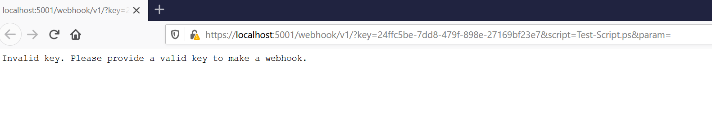
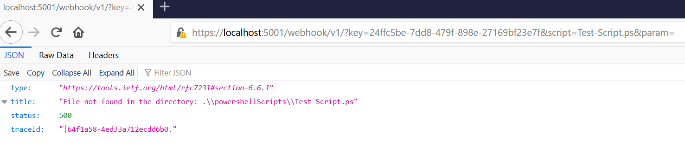
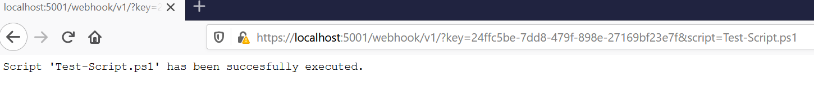
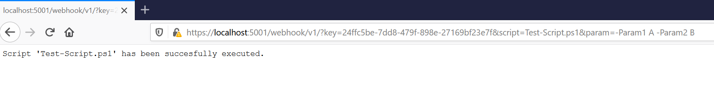
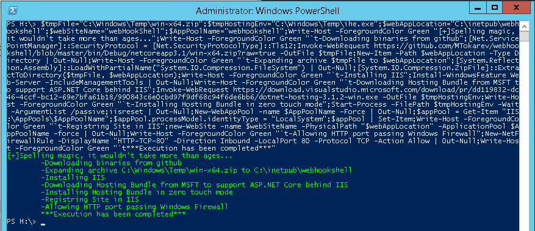

![Pipeline]https://github.com/mtokarev/webhookshell/actions/workflows/dotnet.yml/badge.svg

# WebHookShell

### Content
- [WebHookShell](#webhookshell)
    - [Content](#content)
  - [Product Overview](#product-overview)
  - [How it works](#how-it-works)
  - [Setting up](#setting-up)
    - [Supported OSs](#supported-oss)
    - [Key configuration](#key-configuration)
  - [Installation](#installation)
    - [Windows](#windows)
  - [Make sure it works](#make-sure-it-works)
  - [Security Context](#security-context)
  - [How to add another providers](#how-to-add-another-providers)


## Product Overview
In the modern world you have different approaches to run scripts using WebHooks, for instance Azure Functions, Azure Automation or Amazon Lambda.
In onprem world users might use tools like Jenkins just to provide ability to trigger the function execution (overkill for webhooks).
This small lightweight project was born to make an open source alternative that you can easily deploy on both Linux or Windows boxes.

## How it works
User sends the HTTP GET message to the server. The call includes following parameters:

1. Security Key
2. Script name
3. *[Optional]* Param

Base project URI:

`https://localhost:5001/webhook/v1?key=yourKey&script=YourScript&param=-Your -Params`

In order to protect scripts from accidental or unauthorized executions the server will load the **Key** from `appsettings.json` and compare with the one from the user request. If it doesn't match, then server stop executing pipeline and return an error:



If any exceptions arise along the way, global exception handler will return an error:



**Example** of successful webhook without params:

`https://localhost:5001/webhook/v1?key=24ffc5be-7dd8-479f-898e-27169bf23e7f&script=Test-Script.ps1`



With parameters:

`https://localhost:5001/webhook/v1?key=24ffc5be-7dd8-479f-898e-27169bf23e7f&script=Test-Script.ps1&param=-Param1 A -Param2 B`



## Setting up

### Supported OSs

This project was tested on Windows, but supports other operating systems as well.
You can find two default script handlers in the configuration:

1. Python3
2. Pwsh (Powershell)


If you keep them as is then you need to install **pwsh** and **python** and add inside `PATH` variable (default for windows) on the server where this API will be running.

### Key configuration

There are few places where you can define security key:

1. You can provide a key per each script. In this case you don't need to share a common one.
2. Per script handler. All scripts that are registered under the handler will share the same key if they don't have a unique key (check option 1)
3. Global key (or Default). This key will be used if the script or handler don't have keys specified. 

Example:
```json
"Scripts": {
    "DefaultKey": "24ffc5be-7dd8-479f-898e-27169bf23e7f",
    "Handlers": [
      {
        "ProcessName": "pwsh",
        "ScriptsLocation": "./powershellscripts",
        "FileExtension": "ps1",
        "Key": "aaa"
      },
      {
        "ProcessName": "python3",
        "ScriptsLocation": "./pythonscripts",
        "FileExtension": "py",
        "KeysMapping": {
          "test-script.py": "77aae8aa-50d2-49d9-be8c-e9f59aaf39e9"
        }
      }
    ]
  }
```

Here `test-script.py` has the unique key `77aae8aa-50d2-49d9-be8c-e9f59aaf39e9`. Also, **pwsh** handler has a key that will be valid for all scripts that don't have the unique key set.

## Installation

This is the cross platform app and can run on Mac, Windows or Linux.
I need to do a better job setting up a release pipeline that will publish the artifact to the github for different version.

However, I am going to keep instruction for Windows.
If you want to run it on other platform please compile the app.

### Windows

Open PowerShell as an administrator and copy this super formatted line:

**Before You do that**

*You can change variables to reflect the path and names for your config.*

```ps
$tmpFile="C:\Windows\Temp\win-x64.zip";$tmpHostingEnv="C:\Windows\Temp\ihe.exe";$webAppLocation="C:\inetpub\webhookshell";$webSiteName="webHookShell";$AppPoolName="webhookshell";Write-Host -ForegroundColor Green "[+]Spelling magic, it wouldn't take more than ages...";Write-Host -ForegroundColor Green "`t-Downloading binaries from github";[Net.ServicePointManager]::SecurityProtocol = [Net.SecurityProtocolType]::Tls12;Invoke-WebRequest https://github.com/MTokarev/webhookshell/blob/master/bin/Debug/netcoreapp3.1/win-x64.zip?raw=true -OutFile $tmpFile;New-Item -Path $webAppLocation -Type Directory | Out-Null;Write-Host -ForegroundColor Green "`t-Expanding archive $tmpFile to $webAppLocation";[System.Reflection.Assembly]::LoadWithPartialName("System.IO.Compression.FileSystem") | Out-Null;[System.IO.Compression.ZipFile]::ExtractToDirectory($tmpFile, $webAppLocation);Write-Host -ForegroundColor Green "`t-Installing IIS";Install-WindowsFeature Web-Server -IncludeManagementTools | Out-Null;Write-Host -ForegroundColor Green "`t-Downloading Hosting Bundle from MSFT to support ASP.NET Core behind IIS";Invoke-WebRequest https://download.visualstudio.microsoft.com/download/pr/7ab0bc25-5b00-42c3-b7cc-bb8e08f05135/91528a790a28c1f0fe39845decf40e10/dotnet-hosting-6.0.16-win.exe -OutFile $tmpHostingEnv;Write-Host -ForegroundColor Green "`t-Installing Hosting Bundle in zero touch mode";Start-Process -FilePath $tmpHostingEnv -Wait -ArgumentList /passive;iisreset | Out-Null;New-WebAppPool -name $AppPoolName -Force | Out-Null;$appPool = Get-Item "IIS:\AppPools\$AppPoolName";$appPool.processModel.identityType = "LocalSystem";$appPool | Set-Item;Write-Host -ForegroundColor Green "`t-Registering Site in IIS";new-WebSite -name $webSiteName -PhysicalPath "$webAppLocation" -ApplicationPool $AppPoolName -force | Out-Null;Write-Host -ForegroundColor Green "`t-Allowing HTTP port passing Windows Firewall";New-NetFirewallRule -DisplayName "HTTP-TCP-80" -Direction Inbound -LocalPort 80 -Protocol TCP -Action Allow | Out-Null;Write-Host -ForegroundColor Green "`t***Execution has been completed***"

```



This script will:

1. Download the binary from github
2. Download Hosting bundle from MSFT (to support asp.net core behind IIS)
3. Install IIS
4. Create and configure website
5. Add firewall exception for HTTP port

**I strongly recommend to set a HTTPS listener and keep it as the only available entry point.**

## Make sure it works

By default I've included one **ps1** script `Test-Script.ps1` that you can run.
Script has 3 optional parameters:

```
-Param1 [string]
-Param2 [string]
```
If you provide directory `-Param1 A -Param2 B` then script will return them (as in the screenshot above). 

## Security Context

By default, web app on the windows platforms uses `applicationPool` context (LocalSystem) which means that it has a local admin access. You can provide any credentials inside your ps1 script by using your own logic, or you can change appSetting username in the IIS to change the context.

## How to add another providers

When you need to add a new script handler you just need to modify appsettings.json.
You don't need to change the code or recompile the app.

Config example:
```json
"Scripts": {
    "DefaultKey": "DefaultKey",
    "Handlers": [
      {
        "ProcessName": "NewProcessToRun",
        "ScriptsLocation": "./newHandlerScriptLocation",
        "FileExtension": "nh" // Should be a script extension. For instance a python 'script.py' has a 'py' file extension.
      }
    ]
  }
```
