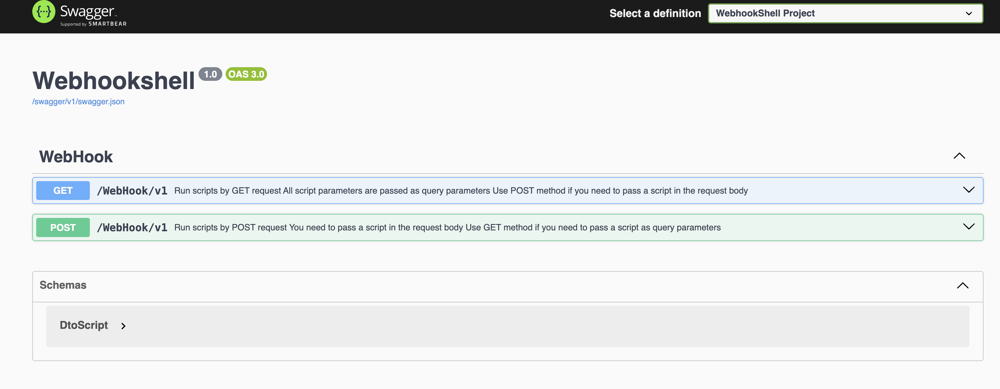

# WebHookShell


### Content
- [WebHookShell](#webhookshell)
    - [Content](#content)
  - [Product Overview](#product-overview)
  - [How it works](#how-it-works)
    - [Test it](#test-it)
    - [GET Example](#get-example)
    - [POST Example](#post-example)
    - [Triggers](#triggers)
      - [Http Methods](#http-methods)
      - [IP Addresses](#ip-addresses)
      - [Time frame](#time-frame)
      - [Example](#example)
  - [Setting up](#setting-up)
    - [Key configuration](#key-configuration)
  - [Installation](#installation)
    - [The easiest way](#the-easiest-way)
    - [Build docker by yourself](#build-docker-by-yourself)
    - [Legacy releases](#legacy-releases)
      - [1. Framework dependent](#1-framework-dependent)
      - [2. Platform specific](#2-platform-specific)
    - [Proxy](#proxy)
  - [Make sure it works](#make-sure-it-works)
  - [Security Context](#security-context)
  - [How to add another providers](#how-to-add-another-providers)

## Product Overview
In the modern world, there are different approaches to running scripts using WebHooks, such as Azure Functions, Azure Automation, or Amazon Lambda. In the on-prem world, users might use tools like Jenkins merely to provide the ability to trigger function execution, which can be overkill for webhooks. This small, lightweight project was born as an open-source alternative that you can easily deploy on both Linux and Windows machines.

<div style="background-color:rgb(196, 109, 109); padding: 10px; border-left: 5px solid #007bff;">
  <strong>Note:</strong> This container should be run behind HTTPS to avoid possible data interception.
</div>

## How it works

Users send an HTTP GET or POST message to the server. The call includes the following parameters:

1. Security Key
2. Script name
3. *[Optional]* Param

### Test it

The project has swagger installed. Just open `http[s]://{YourAddress}:{Port}`.

Example:
 

### GET Example

The base project URI is:

`https://localhost:5001/webhook/v1?key=yourKey&script=YourScript&param=-Your-Params`

To protect scripts from accidental or unauthorized executions, the server will load the **Key** from `appsettings.json` and compare it with the one from the user request. If they don't match, the server will stop executing the pipeline and return an error:


If any exceptions arise along the way, the global exception handler will return an error:


Here is an example of a successful webhook without params:

`https://localhost:5001/webhook/v1?key=24ffc5be-7dd8-479f-898e-27169bf23e7f&script=Test-Script.ps1`


And with parameters:

`https://localhost:5001/webhook/v1?key=24ffc5be-7dd8-479f-898e-27169bf23e7f&script=Test-Script.ps1&param=-Param1-A-Param2-B`


### POST Example
This example is different only in terms how you supply the data.
Here you can see that the http body is used.


### Triggers
Optionally you can specify a trigger for your script. The trigger acts as a filter or the set of rules for the script.
Available triggers:
- httpMethod
- ipAddresses
- timeFrame

#### Http Methods
You can set certain script to be executed only from `POST`, `GET` or from both methods.
**This parameter is optional**. If not set then you can run this script from both methods.

#### IP Addresses
Add IP address to the array if you need to restrict the script to run only from the certain caller IP address.
Both IPv4 and IPv6 are supported.
**Optional parameter**. If not provided then any IP address can call the script.

#### Time frame
You can specify one or more time frames when you have a time constrain.
If set then the script can be launched only on specified time range[s].
Time format `HH:mm:ss` **in UTC**.
**Optional parameter**. If not set then the script can be launched anytime of the day.

#### Example
In this example script `test-script.py` can be executed only from `GET` method and only if the caller is in the `ipAddresses` list.
```json
"ScriptsMapping": [
  {
    "name": "test-script.py",
    "key": "77aae8aa-50d2-49d9-be8c-e9f59aaf39e9",
    "trigger": {
      "httpMethods": ["GET"],
      "ipAddresses": [
        "127.0.0.1",
        "::1"
      ],
      "timeFrames": 
      [
        {
          "startUtc": "03:00:00",
          "endUtc": "07:59:59"
        },
        {
          "startUtc": "23:00:00",
          "endUtc": "00:59:59"
        }
      ]
    }
  }
]
```

## Setting up

You can find two default script handlers in the configuration:

1. Python3
2. Pwsh (Powershell)

If you keep them as they are, you need to install **pwsh** and **python** and add them to the `PATH` variable (default for Windows) on the server where this API will be running.

### Key configuration
There are a few places where you can define the security key:

1. You can provide a key for each script. In this case, you don't need to share a common one.
2. Per script handler. All scripts registered under the handler will share the same key if they don't have a unique key (check option 1).
3. Global key (or Default). This key will be used

 if the script or handler don't have keys specified.

For example:

```json
"Scripts": {
  "DefaultKey": "24ffc5be-7dd8-479f-898e-27169bf23e7f",
  "Handlers": [
    {
      "ProcessName": "pwsh",
      "ScriptsLocation": "./powershellscripts",
      "FileExtension": "ps1",
      "Key": "88aae8aa-50d2-49d9-be8c-e9f59aaf3988"
    },
    {
      "ProcessName": "python3",
      "ScriptsLocation": "./pythonscripts",
      "FileExtension": "py",
      "ScriptsMapping": [
        {
          "name": "test-script.py",
          "key": "77aae8aa-50d2-49d9-be8c-e9f59aaf39e9",
          "trigger": {
            "httpMethods": ["GET"],
            "ipAddresses": [
              "127.0.0.1",
              "::1"
            ]
          }
        }
      ]
    }
  ]
}
```

In this example, the script `test-script.py` has a unique key `77aae8aa-50d2-49d9-be8c-e9f59aaf39e9`. The **pwsh** handler has a key that will be valid for all scripts that don't have a unique key set.

## Installation

This app was built as a cross-platform and can be installed on many well-known platforms such as Mac, Windows, and Linux. There are multiple ways of running this app on the server, but let's concentrate on two major approaches.

### The easiest way

Pull the docker image from the repository.
> **Note:** This container was built and pushed to the dockerHub using `linux/amd64`. Please create an issue in this repository and I will build and publish for the other platforms when I have time.
```
docker pull mtokarevv/webhookshell:latest
docker run --platform linux/amd64 -d -p 8080:8080 webhookshell
```
To check if it works, please navigate to `http://YourAddress:8080`. It should open the Swagger sandbox, where you can run test scripts.

This container can and should be run behind HTTPS:
```
docker run --platform linux/amd64 -d -p 8080:8080 -p 8443:8443 -v /Users/mtokarev/Desktop:/certs:ro -e ASPNETCORE_Kestrel__Certificates__Default__Path=/certs/certificate.pfx -e ASPNETCORE_Kestrel__Certificates__Default__Password=123 webhookshell
```

| Option                                                                 | Explanation                                                                                                           |
|------------------------------------------------------------------------|-----------------------------------------------------------------------------------------------------------------------|
| `-v /Users/mtokarev/Desktop:/certs:ro`                                 | This mounts the local directory `/Users/mtokarev/Desktop` to the `/certs` directory in the container as read-only (`ro`). In this example this directory has a certificate `certificate.pfx`. |
| `-e ASPNETCORE_Kestrel__Certificates__Default__Path=/certs/certificate.pfx` | This sets an environment variable to specify the path to the SSL certificate (`certificate.pfx`) inside the container.  |
| `-e ASPNETCORE_Kestrel__Certificates__Default__Password=123`            | This sets an environment variable to specify the password for the SSL certificate (`certificate.pfx`).                |

You can also bind a folder from the host if you want by using `-v` when you run the container.

### Build docker by yourself

Make sure you have git and docker installed.
```
git clone https://github.com/MTokarev/webhookshell.git && cd webhookshell
docker build -t webhookshell .
docker run -d -p 8080:8080 webhookshell 
```

### Legacy releases

This repository no longer publishes releases except docker images. Please build project by yourself if needed or consider run it as a docker container.

#### 1. Framework dependent

The biggest advantage of the framework-dependent version is a smaller app footprint. This app does not include a runtime and hence is lightweight, consuming only 100-200KB of storage. It is also easier to distribute because the same executable can be run on different platforms.

To use this approach, you need to install the .NET 6.0 runtime on the server. You can download and follow the steps outlined on this [page](https://dotnet.microsoft.com/en-us/download/dotnet/6.0).

#### 2. Platform specific

This is a self-contained package that includes a runtime and can be executed on the server without installing dependencies. Because it includes a runtime that is specific to the operating system (and architecture), you cannot run a Windows build on Linux and vice versa.

Also, the build will be heavier than the framework-dependent version.

I have a **TODO** item to simplify the release process and publish binaries for all platforms together. Currently, you can find published binaries [here](https://github.com/MTokarev/webhookshell/releases).

Each platform will have a dedicated release. For example, `Release 14` will include:
- Release 14 for Windows
- Release 14 for RedHat
- Release 14 for Linux
- Release 14 (Requires .NET 6.0 runtime)

**I strongly recommend setting up an HTTPS listener and keeping it as the only available entry point.**

### Proxy
You can run this API as a service or put it behind the proxy/web server. For instance IIS, Apache, NGINX.

## Make sure it works

By default, I've included one **ps1** script `Test-Script.ps1` that you can run. The script has 3 optional parameters:

```
-Param1 [string]
-Param2 [string]
```
If you provide `-Param1 A -Param2 B` as parameters, the script will return them (as shown in the screenshot above).

Test it [using swagger](#test-it)

## Security Context

By default, the web app on Windows platforms uses the `applicationPool` context (LocalSystem), which means that it has local admin access. You can provide any credentials inside your ps1 script by using your own logic, or you can change the appSetting username in IIS to change the context.

On linux it is up to you to choose the user context.

## How to add another providers

When you need to add a new script handler, you just need to modify `appsettings.json`. You don't need to change the code